Intermediate steps of the generative model
==========================================

|           | Input Labels                                                 | Deformed Labels                                                    | GMM Sampling                                                 | Bias Corruption | Downsampling | Inputs for training |
| --------- | ------------------------------------------------------------ | ------------------------------------------------------------------ | ------------------------------------------------------------ | --------------- | --------------- | --------------- |
| 8-month-old |  |  |  |  | 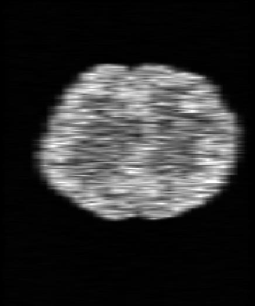 | 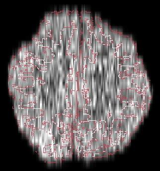 |
| 4-month-old | 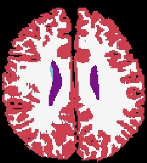 | 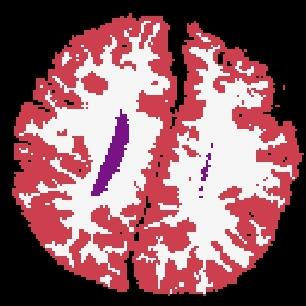 | 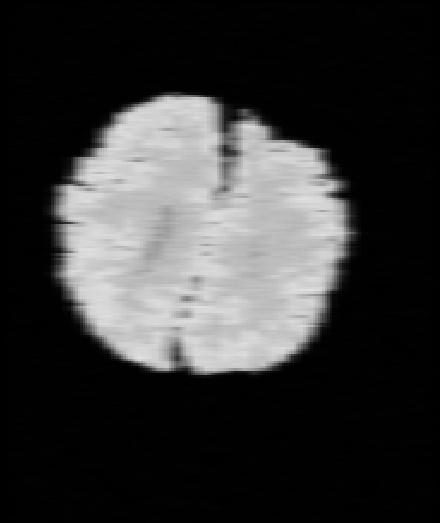 | 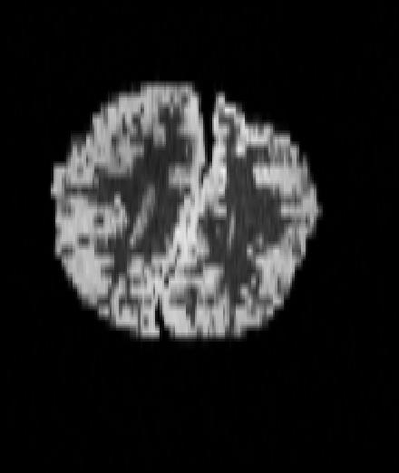 | 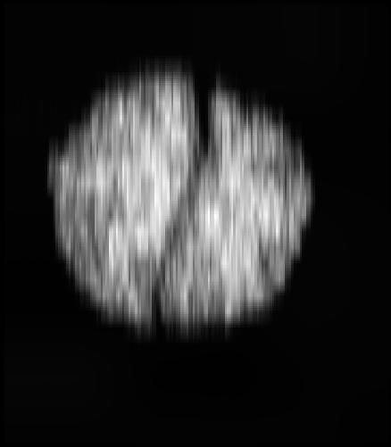 | 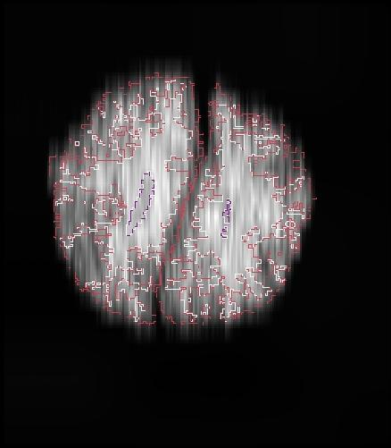 |
| 0-month-old | 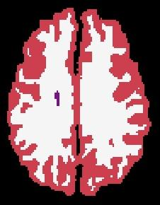 | 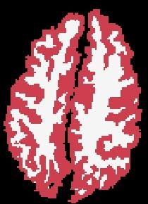 |  | 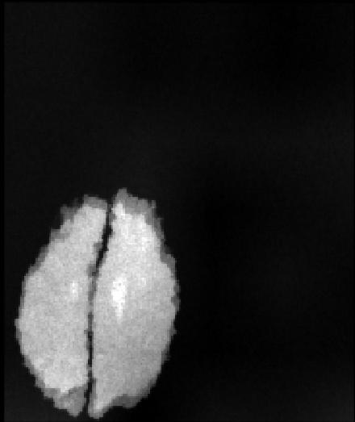 | 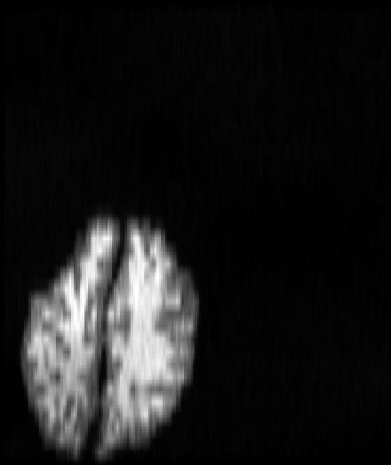 | 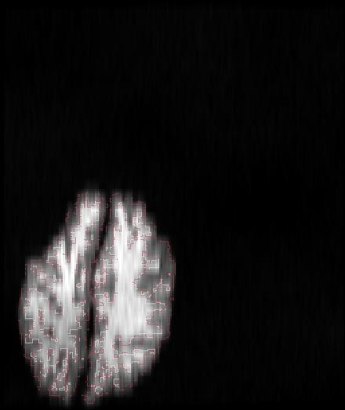 |

1. we first randomly
select an input label map, that is 
2. spatially augmented with a 3D
transformation. 
3. A first synthetic image is obtained by sampling a
GMM of randomised parameters at HR. 
4. The result is then corrupted
with a bias field and further intensity augmentation. 
5. Slice spacing
and thickness are simulated by successively blurring and downsampling
at random LR. 
6. The training inputs are obtained by resampling to
HR, and keeping the labels of the relevant structures (at the original
resolution) for segmentation.